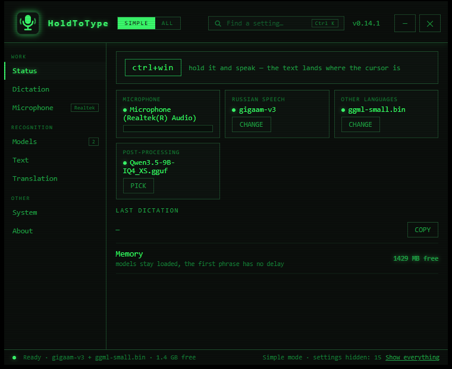
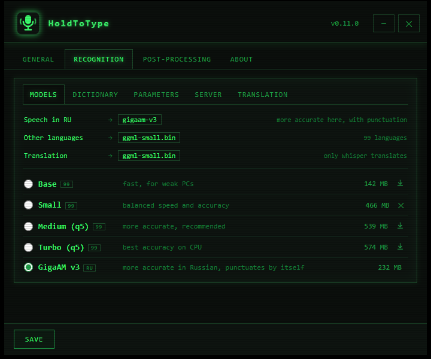
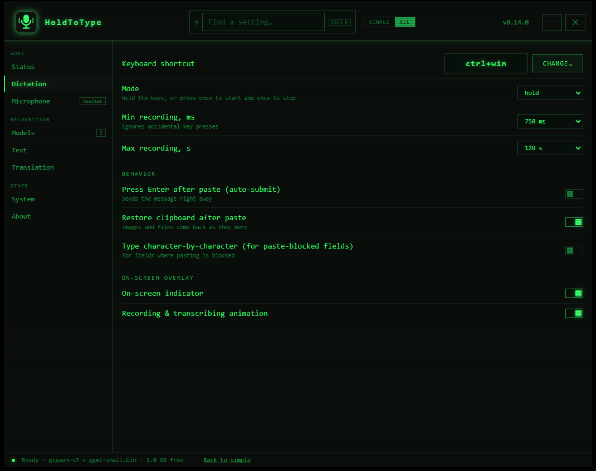

<p align="center">
  
</p>

<h1 align="center">HoldToType</h1>

<p align="center">
  Voice → text at the cursor position. Fully local, offline, retro-terminal styled.
</p>

<p align="center">
  
  
  
  
  
  
  
  <a href="https://github.com/Vitalii-Yemets/holdtotype/actions/workflows/ci.yml"></a>
</p>

---

Hold a hotkey — speak. Release — the transcribed text is pasted right where your cursor is. Works in any Windows application: messengers, editors, browsers, IDEs. Audio and text never leave your computer — recognition and post-processing run locally on the CPU.

## 📸 Screenshots

| Installer | Status screen |
|---|---|
|  |  |
| **Model catalog** | **Post-processing (LLM)** |
|  |  |

## ✨ Features

- 🎙️ **Dictation at the cursor** — a global configurable hotkey (left and right modifiers are interchangeable — Ctrl means either one); text is inserted via the clipboard or typed character-by-character (for paste-blocked fields), with optional auto-Enter.
- 🎯 **Safe insertion** — the target window is captured when you press the hotkey; if focus changes while the speech is processed, nothing is pasted — the plate itself asks on a second line: *Insert here* / *Copy*, and auto-Enter fires only when the target still matches. The final transcript always stays available in the tray (*Copy last result*), so a failed paste never loses a dictation.
- 📋 **Clipboard-friendly** — restoring the clipboard after insertion preserves **all** formats (images, files, rich text); when a snapshot is impossible the clipboard is left untouched and the text is typed instead.
- 📟 **On-screen overlay** — one pill and nothing else: live voice level while recording, processing stages, the recognised text itself when it lands, and — on a second line when needed — the questions (which language to translate into, where to insert when focus changed) with mouse or keyboard answers. It can sit at the bottom of the screen, at the top, or follow the cursor. The ✕ or Esc cancels at any stage; input focus is never stolen.
- 🌍 **Translation powered by Whisper** — to English via the native translate mode, to Ukrainian / German / French / Spanish / Italian / Polish / Russian by forcing the output language. Three modes: always translate to the target language, ask on the plate before every dictation, or ask with a countdown.
- 🤖 **Local LLM post-processing** (llama.cpp) — a chain of prompts removes filler words, changes style, formats text; each prompt can have its own hotkey; a test field runs a sample through the live model right from Settings.
- 🇷🇺 **Two recognition engines, routed automatically** — Whisper (99 languages, translation) and GigaAM v3 through sherpa-onnx (Russian only, punctuates by itself). Measured on the same 11-second file: 0.47 s against 11.6 s, 277 MB of RAM against 814 MB, no mistakes against three. Russian speech goes to GigaAM, every other language and any translation goes to Whisper — the second engine starts in about a second when it is needed and unloads itself after ten idle minutes, so two models never sit in memory for nothing. Settings show the routing table, and `stt_engine` in `config.json` forces one engine when you want to.
- 🧭 **Model picker and honest numbers** — three questions (language, priority, translation) and the catalog answers with a model and the reason. Every entry shows the memory it will actually take, measured against what is free right now, and filters narrow the list to Russian, multilingual, punctuating or simply "fits in memory".
- ✏️ **Punctuation your way** — take it from the recognition model, have the editor model add it, or strip it and get plain lowercase text.
- 📦 **Built-in model catalog** — recognition models download in one click; GGUF models for the LLM are searched on Hugging Face with last-update date, download counts and a color indicator showing whether the model fits your RAM.
- 🎚️ **Microphone control** — pick the input device from the settings, watch a live level meter before dictating, and keep working when a headset is unplugged (the app falls back to the system default automatically). Silent recordings are never sent to recognition, so background noise can't turn into invented text.
- 📖 **Recognition dictionary** — terms and abbreviations hint rare words to Whisper; a multilingual starter set is preinstalled.
- 🗣️ **8 UI languages** — English, Ukrainian, Russian, German, French, Spanish, Italian, Polish. Everything is translated: screens, dialogs, the overlay, the tray, the uninstaller and the in-app guide. Switching is instant, "Same as system" follows Windows.
- 🔊 **Sound themes** — several synthesized cue sets plus Windows system sounds, with preview.
- ⚡ **Nothing to save, nothing to restart** — every change applies the moment you make it; the Save button is gone. The settings that describe the recognition server — port, threads, server path, remote URL, autostart — restart the recognizer itself, which takes about a second; the app is never asked to be restarted.
- 🔍 **Find a setting** — Ctrl+K, a word, and the window jumps to the right section and highlights the row, even when the row is hidden by simple mode.
- 🧭 **First-run wizard** — five steps on the very first launch: interface language, the dictation language (the model is chosen and downloaded for you, with a progress bar), the shortcut and microphone with a live level bar, a field to try a real dictation into, and starting with Windows. Skipping it leaves a working app; upgrades never see it.
- 🎚️ **Simple mode** — new installs open with 15 rarely-touched settings folded away behind "N more settings" in each section, and a SIMPLE/ALL switch in the title bar shows which view is on. Upgrades keep the full view, because taking away settings someone has already seen is a regression.
- ⏯️ **Hold or toggle** — hold the keys as before, or press once to start and once to stop.
- 🖥️ **One window, eight sections** — a sidebar instead of tabs inside tabs: Status, Dictation, Microphone, Models, Text, Translation, System, About. The Status screen answers "is everything ready" at a glance — hotkey, microphone, engine and model, free memory, last dictation — and a status bar keeps that answer visible from every section.
- 🖥️ **Tray application** — color-coded status icon, quick menu, a Pip-Boy-terminal-styled settings window that remembers its size.
- 💾 **Portable** — the folder is self-contained: copy it to a USB stick and run on another PC; nothing is written to the registry.
- 🛡️ **Private** — zero network requests while dictating; internet is only needed to download models.

## 🚀 Installation

### Option A — installer

Download `holdtotype-setup.exe` from [Releases](https://github.com/Vitalii-Yemets/holdtotype/releases) and run it. The themed installer (~16 MB):

- installs without admin rights to `%LOCALAPPDATA%\Programs\HoldToType` (pick any folder via the browse button);
- can download the recognition model right during installation (Base / Small / Medium / Turbo, or skip and get it on first run);
- creates a Start Menu shortcut and, optionally, autostart with Windows;
- registers in "Apps & features".

Silent install: `holdtotype-setup.exe -silent -dir "C:\path" -model small` (model: `base|small|medium|turbo`, omit to skip).

### Updates

- **About → Info** has a "Check for updates" button; optionally the app can check on startup (off by default — this is the only network request besides model downloads).
- One click downloads the new installer and updates in place: **settings and downloaded models are always preserved**, the app restarts itself.
- Running a newer `holdtotype-setup.exe` manually also detects the existing installation and switches to update mode.

### Option B — portable

Download the archive from Releases (or build `dist/` yourself), copy the folder anywhere and run `holdtotype.exe`. Settings, models and the log live next to the exe and travel with the folder.

### Requirements

- Windows 10/11 x64;
- a CPU with AVX2 (roughly 2013 or newer) — **no GPU required**;
- WebView2 Runtime for the settings window (bundled with Windows 11; if missing, the app opens the download page);
- RAM: ~1 GB for recognition (small model); for LLM post-processing — depends on the chosen model (the search indicator will tell).

## 🎯 Usage

1. Launch the app — a green microphone icon appears in the tray.
2. On the very first launch a five-step wizard opens: interface language, the language you will dictate in (it picks and downloads the model for you), the shortcut and microphone with a live level bar, a field to try a dictation into, and — last — starting with Windows. Skip it and everything still works; run `holdtotype.exe -wizard` to see it again.
3. Place the cursor in any input field, **hold `Ctrl+Win`** (configurable), say a phrase, **release** — the text is inserted.
4. Right-click the tray icon — the menu: enable/disable, settings, config, log, quit.

Icon colors: green — ready, red — recording, orange — transcribing, grey — disabled/error.

A full description of every feature lives in the **About → Guide** tab inside the app (a mini-wiki with illustrations).

### Safe insertion

<p align="center"></p>

Speech processing takes a few seconds — if you switch windows in the meantime, HoldToType notices that the focus no longer matches the window you dictated into. Nothing is pasted blindly: the plate grows a second line and asks, with a countdown shrinking under the highlighted answer — insert into the current window, copy the text to the clipboard, or do nothing. Enter takes the highlighted answer, 1…9 pick a button, Esc cancels. The result is also kept in memory — the tray menu's *Copy last result* recovers any dictation whose insertion failed.

## ⚙️ Settings

Left-click the tray icon to open the settings window. Eight sections in the sidebar, no tabs inside tabs:

| Section | Contents |
|---|---|
| **Status** | is everything ready, at a glance: hotkey, microphone with a live level, the model for Russian and the one for every other language, the post-processing model, free memory, and the last dictation with *Copy* |
| **Dictation** | the hotkey, hold or toggle, auto-Enter, the on-screen overlay; folded away: recording durations, clipboard restore, character-by-character typing, overlay animation |
| **Microphone** | input device with a live level meter, recording cue sounds and the sound theme |
| **Models** | the recognition catalog with filters and honest RAM numbers, the picker that answers with a model and the reason, recognition language, CPU threads, and the editor model for post-processing (installed + Hugging Face search) |
| **Text** | where punctuation comes from, the recognition dictionary, and the chain of post-processing prompts |
| **Translation** | target language, when to ask, dialog languages, a separate translation hotkey |
| **System** | UI language and updates; folded away: whisper-server autostart, port, path, external server URL |
| **About** | version, a detailed guide-wiki, about the author |

Everything applies the moment you change it — there is no Save button and no dialog about unsaved changes. Settings that describe the recognition server (port, threads, server path, remote URL, autostart) restart the recognizer in place, so nothing waits for an app restart. Settings that do not apply in the current mode are greyed out automatically.

## 🌐 How translation works

All translation is done by Whisper itself — no second neural network needed:

| Target | Mechanism | Quality |
|---|---|---|
| English | native `translate` mode | excellent |
| other languages | forced output language (**experimental**) | depends on the language pair; better into major languages |

Note: the Turbo model is not trained for the translation task — the app shows a warning on the Translation tab when Turbo is active; pick Base/Small/Medium for translating.

Modes: "always translate to the target language" (a checkbox, no questions), "always ask" and "ask with a timeout" — a language dialog appears above the overlay before transcription; when the countdown expires the target language is applied, ✕/Esc inserts without translation.

## 🧠 Post-processing (LLM)

An optional second layer: a local language model edits the transcribed text according to your prompts. Presets ship out of the box: "Cleanup" and "Business style". Checked prompts apply as a chain to every dictation; a prompt with its own hotkey applies alone, once.

Models are picked via the Hugging Face search (GGUF format): every quant file shows its size and an estimated RAM requirement — a green/amber/red indicator relative to your RAM. Recommendations: 1.5–3B (Q4_K_M) — fast; 7–9B — smarter but takes seconds per pass on CPU.

## 🔨 Building from source

The only requirement is a running **Docker Desktop** — nothing is installed on the machine: no Go, no compilers, no packaging tools.

```powershell
.\build.ps1                 # small model (~466 MB)
.\build.ps1 -Model medium   # more accurate, larger
```

The result lands in `dist/`:

| File | What it is |
|---|---|
| `holdtotype.exe` | tray client (Go + WinAPI, WebView2) |
| `whisper-server.exe` | recognition (whisper.cpp), static build |
| `sherpa-server.exe` | recognition (sherpa-onnx), official static build, pinned and checksum-verified |
| `llama-server.exe` | post-processing (llama.cpp), static build |
| `holdtotype-setup.exe` | installer (Go + WebView2, payload embedded) |
| `models/ggml-*.bin` | the Whisper model |
| `models/gigaam-v3/` | the GigaAM v3 model: encoder, decoder, joiner, tokens |
| `config.default.json` | default settings |

The pipeline: MinGW-w64 cross-compilation of whisper.cpp and llama.cpp inside a Linux container, the Go client with cgo (microphone capture), icon generation, installer packaging — all in `build/Dockerfile`. Both engines are pinned to specific upstream versions (`WHISPER_CPP_VERSION`, `LLAMA_CPP_VERSION` build args), so builds stay reproducible.

## 🧪 Tests

Everything runs in containers — nothing to install locally:

```powershell
docker build --file build/Dockerfile --target gotest .        # Go unit tests + go vet (Windows target)
docker run --rm -v "${PWD}:/w" -w /w node:20 sh -c "node test/build-page.js && cd test && npm i --no-save --silent jsdom && node ui.test.js"
```

- `client/internal/...` — unit tests for update-version comparison and hotkey duplicate detection.
- `test/ui.test.js` — 20 checks against the real settings page rendered in jsdom: tab and sub-tab switching, the translation enable/disable matrix, the prompt editor accordion, model deletion, About sub-tabs, and "no JavaScript errors".

The same suites run in GitHub Actions on every push, together with a full Windows build of all binaries.

## 🏗️ Architecture

```
┌────────────────────────────────────────────────────────┐
│  holdtotype.exe (Go + WinAPI)                         │
│  tray · keyboard hook · recording · overlay · paste    │
│  settings UI: WebView2                                 │
└──────────┬─────────────────────────────┬───────────────┘
           │ HTTP 127.0.0.1:8910         │ HTTP 127.0.0.1:8911
   ┌───────▼────────┐            ┌───────▼────────┐
   │ whisper-server │            │  llama-server  │
   │  recognition   │            │ prompts (LLM)  │
   │ + translation  │            │   on demand    │
   └────────────────┘            └────────────────┘
```

The servers are hidden child processes tied to a Job Object: they die together with the app. They listen on localhost only, and llama-server is additionally protected with a per-session API key, so other local programs cannot use it. The Whisper model stays in memory between phrases; the LLM starts on first use.

**Data boundary:** everything is processed locally. The only exception is the optional *External server URL* setting (Recognition → Server) — when set, recorded audio is sent to that server instead of the local one. Use it only with hosts you trust; leave it empty for a fully offline setup.

Files next to the exe: `config.json` (all settings; manual edits apply via "Reload config.json" in the tray menu), `holdtotype.log` (rotated, never exceeds ~2 MB on disk), `models/`.

## 🗑️ Uninstall

"Apps & features" → HoldToType, or `holdtotype.exe -uninstall`. The uninstaller asks whether to delete settings and downloaded models, then cleans up files, the shortcut and the registry. The portable version is removed by deleting the folder.

## 📄 License

[MIT](LICENSE) © Vitalii Yemets. Bundled engines keep their own licenses: [whisper.cpp](https://github.com/ggerganov/whisper.cpp) and [llama.cpp](https://github.com/ggml-org/llama.cpp) are MIT-licensed; downloaded models are covered by their respective licenses on Hugging Face.

## 👤 Author

**Vitalii Yemets** — [github.com/Vitalii-Yemets](https://github.com/Vitalii-Yemets)

Found a bug or have an idea — open an [issue](https://github.com/Vitalii-Yemets/holdtotype/issues).
