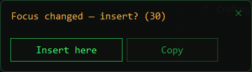

<p align="center">
  
</p>

<h1 align="center">Vox Terminal</h1>

<p align="center">
  Voice → text at the cursor position. Fully local, offline, retro-terminal styled.
</p>

<p align="center">
  
  
  
  
  
  
</p>

---

Hold a hotkey — speak. Release — the transcribed text is pasted right where your cursor is. Works in any Windows application: messengers, editors, browsers, IDEs. Audio and text never leave your computer — recognition and post-processing run locally on the CPU.

## 📸 Screenshots

| Installer | Settings |
|---|---|
|  |  |
| **Model catalog** | **Post-processing (LLM)** |
|  |  |

## ✨ Features

- 🎙️ **Dictation at the cursor** — a global configurable hotkey (left/right modifiers are distinguished); text is inserted via the clipboard or typed character-by-character (for paste-blocked fields), with optional auto-Enter.
- 🎯 **Safe insertion** — the target window is captured when you press the hotkey; if focus changes while the speech is processed, nothing is pasted — a dialog offers *Insert here* / *Copy* instead, and auto-Enter fires only when the target still matches. The final transcript always stays available in the tray (*Copy last result*), so a failed paste never loses a dictation.
- 📋 **Clipboard-friendly** — restoring the clipboard after insertion preserves **all** formats (images, files, rich text); when a snapshot is impossible the clipboard is left untouched and the text is typed instead.
- 📟 **On-screen overlay** — a pill at the bottom of the screen: live voice level while recording, processing stages, the result; the ✕ cancels at any stage; input focus is never stolen.
- 🌍 **Translation powered by Whisper** — to English via the native translate mode, to Ukrainian / German / French / Spanish / Italian / Polish / Russian by forcing the output language. Three modes: always translate to the target language, ask with a dialog before every dictation, or ask with a countdown.
- 🤖 **Local LLM post-processing** (llama.cpp) — a chain of prompts removes filler words, changes style, formats text; each prompt can have its own hotkey; a test field runs a sample through the live model right from Settings.
- 📦 **Built-in model catalog** — Whisper models download in one click; GGUF models for the LLM are searched on Hugging Face with last-update date, download counts and a color indicator showing whether the model fits your RAM.
- 📖 **Recognition dictionary** — terms and abbreviations hint rare words to Whisper; a multilingual starter set is preinstalled.
- 🗣️ **8 UI languages** — English, Ukrainian, Russian, German, French, Spanish, Italian, Polish; switching is instant, "Same as system" follows Windows.
- 🔊 **Sound themes** — several synthesized cue sets plus Windows system sounds, with preview.
- 🖥️ **Tray application** — color-coded status icon, quick menu, a Pip-Boy-terminal-styled settings window that remembers its size.
- 💾 **Portable** — the folder is self-contained: copy it to a USB stick and run on another PC; nothing is written to the registry.
- 🛡️ **Private** — zero network requests while dictating; internet is only needed to download models.

## 🚀 Installation

### Option A — installer

Download `voxterminal-setup.exe` from [Releases](https://github.com/Vitalii-Yemets/vox-terminal/releases) and run it. The themed installer (~16 MB):

- installs without admin rights to `%LOCALAPPDATA%\Programs\VoxTerminal` (pick any folder via the browse button);
- can download the recognition model right during installation (Base / Small / Medium / Turbo, or skip and get it on first run);
- creates a Start Menu shortcut and, optionally, autostart with Windows;
- registers in "Apps & features".

Silent install: `voxterminal-setup.exe -silent -dir "C:\path" -model small` (model: `base|small|medium|turbo`, omit to skip).

### Updates

- **About → Info** has a "Check for updates" button; optionally the app can check on startup (off by default — this is the only network request besides model downloads).
- One click downloads the new installer and updates in place: **settings and downloaded models are always preserved**, the app restarts itself.
- Running a newer `voxterminal-setup.exe` manually also detects the existing installation and switches to update mode.

### Option B — portable

Download the archive from Releases (or build `dist/` yourself), copy the folder anywhere and run `voxterminal.exe`. Settings, models and the log live next to the exe and travel with the folder.

### Requirements

- Windows 10/11 x64;
- a CPU with AVX2 (roughly 2013 or newer) — **no GPU required**;
- WebView2 Runtime for the settings window (bundled with Windows 11; if missing, the app opens the download page);
- RAM: ~1 GB for recognition (small model); for LLM post-processing — depends on the chosen model (the search indicator will tell).

## 🎯 Usage

1. Launch the app — a green microphone icon appears in the tray.
2. Place the cursor in any input field, **hold `Ctrl+Win`** (configurable), say a phrase, **release** — the text is inserted.
3. Right-click the tray icon — the menu: enable/disable, settings, config, log, quit.

Icon colors: green — ready, red — recording, orange — transcribing, grey — disabled/error.

A full description of every feature lives in the **About → Guide** tab inside the app (a mini-wiki with illustrations).

### Safe insertion

<p align="center"></p>

Speech processing takes a few seconds — if you switch windows in the meantime, Vox Terminal notices that the focus no longer matches the window you dictated into. Nothing is pasted blindly: the dialog above appears with a countdown, offering to insert into the current window, copy the text to the clipboard, or do nothing. The result is also kept in memory — the tray menu's *Copy last result* recovers any dictation whose insertion failed.

## ⚙️ Settings

Left-click the tray icon to open the settings window:

| Tab | Contents |
|---|---|
| **General** | hotkey, UI and recognition languages, sound themes, auto-Enter, clipboard restore, overlay and animation, type mode |
| **Recognition → Models** | the Whisper catalog: Base / Small / Medium / Turbo, one-click download and switching |
| **Recognition → Dictionary** | a recognition hint: terms, names, abbreviations, comma-separated |
| **Recognition → Parameters** | CPU threads, min/max recording duration |
| **Recognition → Server** | whisper-server autostart, port, external server URL |
| **Recognition → Translation** | target language, translation modes, dialog languages, a separate translation hotkey |
| **Post-processing** | LLM models (installed + Hugging Face search) and the prompt chain with checkboxes |
| **About** | info, a detailed guide-wiki, about the author |

Unsaved changes are tracked: when leaving a tab the app asks whether to keep them. Settings that do not apply in the current mode are greyed out automatically.

## 🌐 How translation works

All translation is done by Whisper itself — no second neural network needed:

| Target | Mechanism | Quality |
|---|---|---|
| English | native `translate` mode | excellent |
| other languages | forced output language (**experimental**) | depends on the language pair; better into major languages |

Note: the Turbo model is not trained for the translation task — the app shows a warning on the Translation tab when Turbo is active; pick Base/Small/Medium for translating.

Modes: "always translate to the target language" (a checkbox, no questions), "always ask" and "ask with a timeout" — a language dialog appears above the overlay before transcription; when the countdown expires the target language is applied, ✕/Esc inserts without translation.

## 🧠 Post-processing (LLM)

An optional second layer: a local language model edits the transcribed text according to your prompts. Presets ship out of the box: "Cleanup" and "Business style". Checked prompts apply as a chain to every dictation; a prompt with its own hotkey applies alone, once.

Models are picked via the Hugging Face search (GGUF format): every quant file shows its size and an estimated RAM requirement — a green/amber/red indicator relative to your RAM. Recommendations: 1.5–3B (Q4_K_M) — fast; 7–9B — smarter but takes seconds per pass on CPU.

## 🔨 Building from source

The only requirement is a running **Docker Desktop** — nothing is installed on the machine: no Go, no compilers, no packaging tools.

```powershell
.\build.ps1                 # small model (~466 MB)
.\build.ps1 -Model medium   # more accurate, larger
```

The result lands in `dist/`:

| File | What it is |
|---|---|
| `voxterminal.exe` | tray client (Go + WinAPI, WebView2) |
| `whisper-server.exe` | recognition (whisper.cpp), static build |
| `llama-server.exe` | post-processing (llama.cpp), static build |
| `voxterminal-setup.exe` | installer (Go + WebView2, payload embedded) |
| `models/ggml-*.bin` | the Whisper model |
| `config.default.json` | default settings |

The pipeline: MinGW-w64 cross-compilation of whisper.cpp and llama.cpp inside a Linux container, the Go client with cgo (microphone capture), icon generation, installer packaging — all in `build/Dockerfile`.

## 🏗️ Architecture

```
┌────────────────────────────────────────────────────────┐
│  voxterminal.exe (Go + WinAPI)                         │
│  tray · keyboard hook · recording · overlay · paste    │
│  settings UI: WebView2                                 │
└──────────┬─────────────────────────────┬───────────────┘
           │ HTTP 127.0.0.1:8910         │ HTTP 127.0.0.1:8911
   ┌───────▼────────┐            ┌───────▼────────┐
   │ whisper-server │            │  llama-server  │
   │  recognition   │            │ prompts (LLM)  │
   │ + translation  │            │   on demand    │
   └────────────────┘            └────────────────┘
```

The servers are hidden child processes tied to a Job Object: they die together with the app. They listen on localhost only, and llama-server is additionally protected with a per-session API key, so other local programs cannot use it. The Whisper model stays in memory between phrases; the LLM starts on first use.

**Data boundary:** everything is processed locally. The only exception is the optional *External server URL* setting (Recognition → Server) — when set, recorded audio is sent to that server instead of the local one. Use it only with hosts you trust; leave it empty for a fully offline setup.

Files next to the exe: `config.json` (all settings; manual edits apply via "Reload config.json" in the tray menu), `voxterminal.log` (rotated, never exceeds ~2 MB on disk), `models/`.

## 🗑️ Uninstall

"Apps & features" → Vox Terminal, or `voxterminal.exe -uninstall`. The uninstaller asks whether to delete settings and downloaded models, then cleans up files, the shortcut and the registry. The portable version is removed by deleting the folder.

## 👤 Author

**Vitalii Yemets** — [github.com/Vitalii-Yemets](https://github.com/Vitalii-Yemets)

Found a bug or have an idea — open an [issue](https://github.com/Vitalii-Yemets/vox-terminal/issues).
