<p align="center">
  
</p>

<h1 align="center">HoldToType</h1>

<p align="center">
  Voice → text at the cursor position. Fully local, offline, retro-terminal styled.
</p>

<p align="center">
  
  
  
  
  
  
  
  <a href="https://github.com/Vitalii-Yemets/holdtotype/actions/workflows/ci.yml"></a>
</p>

---

Hold a hotkey — speak. Release — the transcribed text is pasted right where your cursor is. Works in any Windows application: messengers, editors, browsers, IDEs. Audio and text never leave your computer — recognition and post-processing run locally on the CPU. (One deliberate exception exists: if you yourself point post-processing at an external OpenAI-compatible server in Settings, the recognized text — never the audio — goes there. It is off by default and loudly labeled.)

## 📸 Screenshots

One build, five designs. Every shot below is the same program with a different design picked in Settings — Terminal is the green default, Editor follows VS Code, Neon is violet and rounded, Soft and Document stand on light ground.

| Status — Terminal | System — Editor |
|---|---|
| [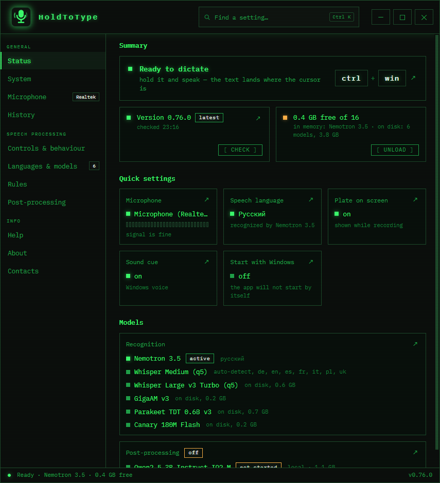](docs/shot-state-terminal.png) | [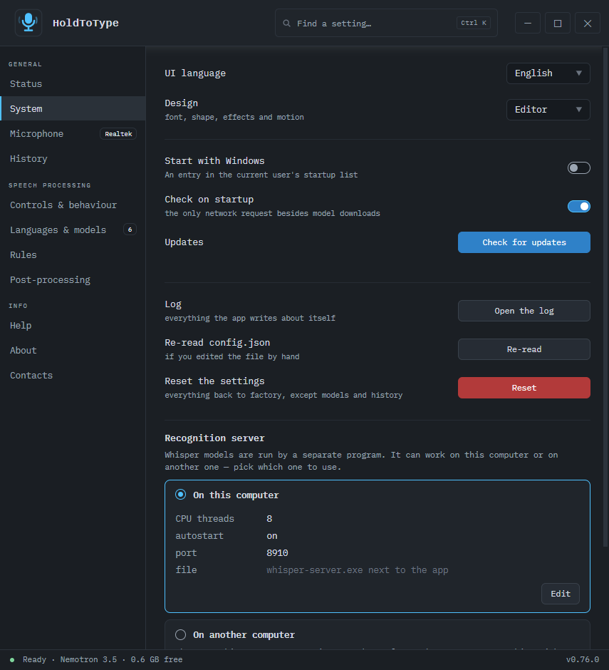](docs/shot-system-editor.png) |
| **Help — Editor** | **Languages & models — Neon** |
| [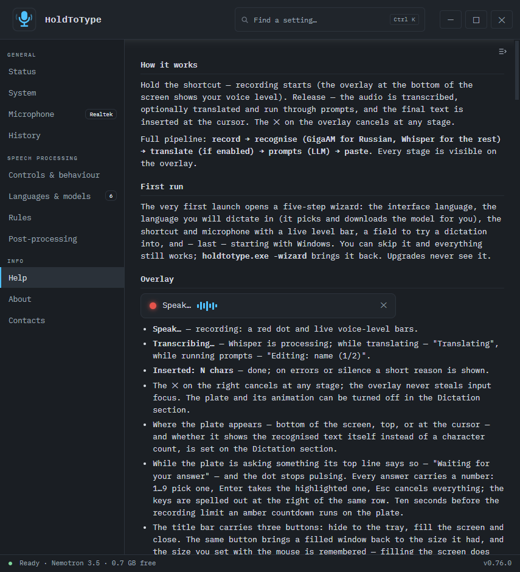](docs/shot-help-editor.png) | [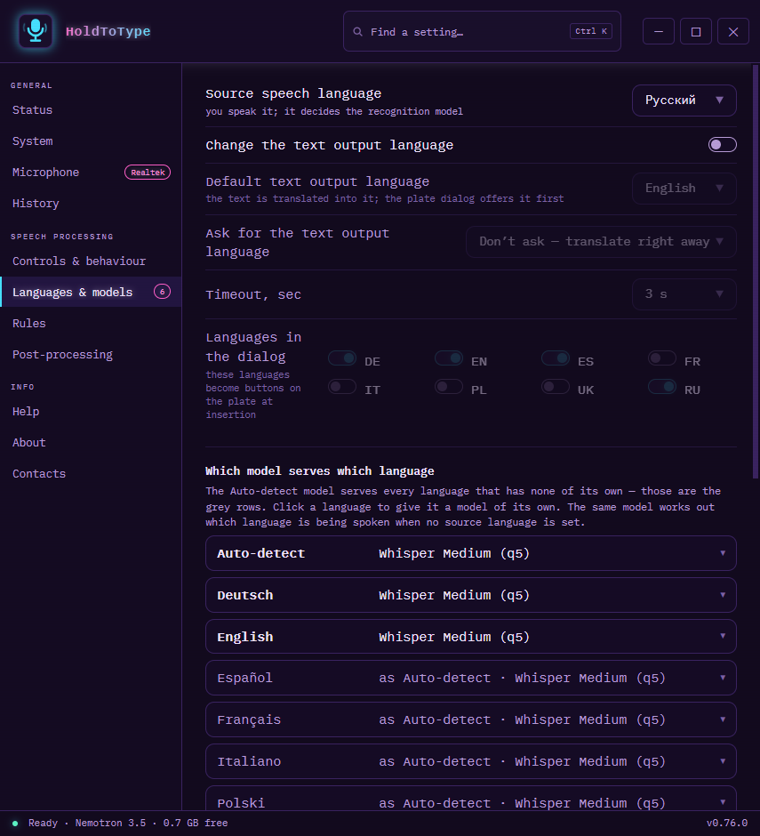](docs/shot-models-neon.png) |
| **History — Soft** | **Post-processing — Document** |
| [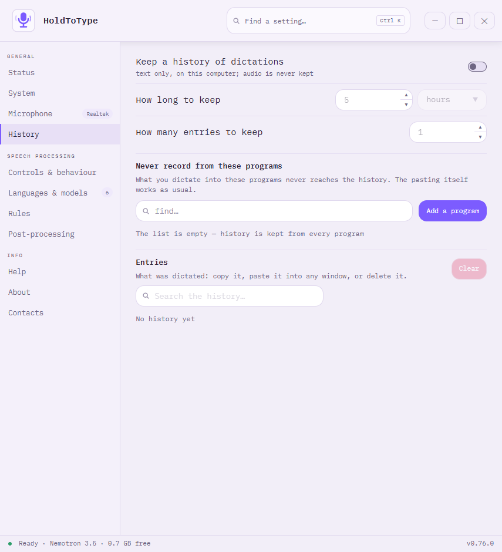](docs/shot-history-soft.png) | [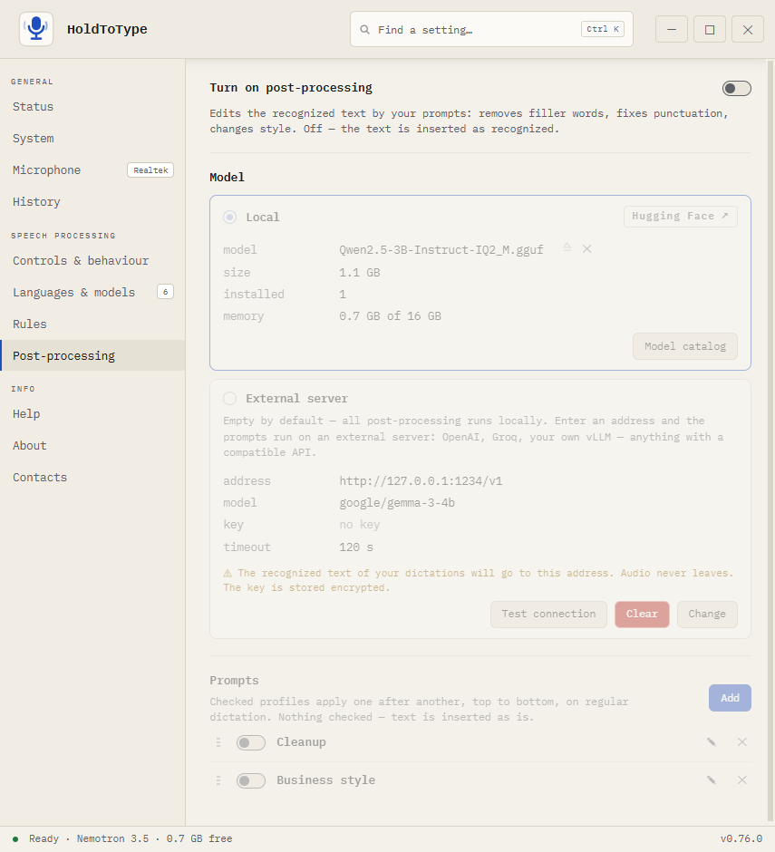](docs/shot-post-paper.png) |
| **Rules — Terminal** | **Controls & behaviour — Terminal** |
| [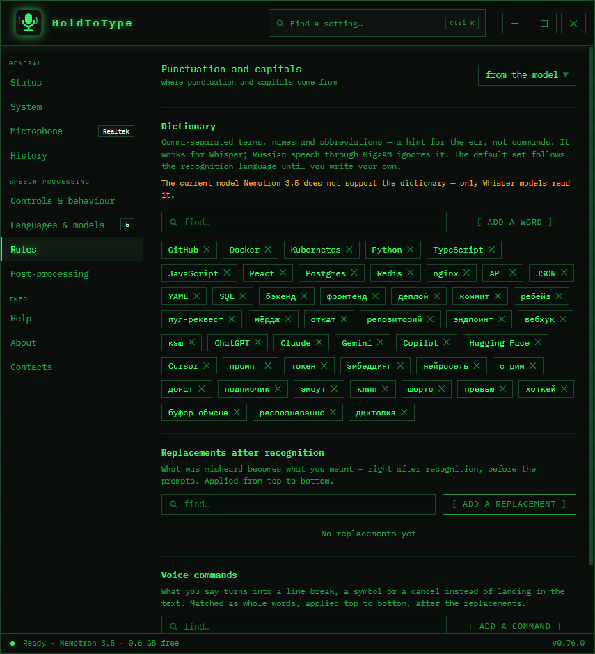](docs/shot-rules-terminal.png) | [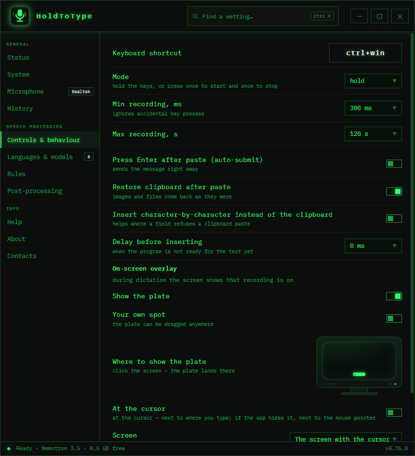](docs/shot-dictation-terminal.png) |
| **Microphone — Soft** | **About — Document** |
| [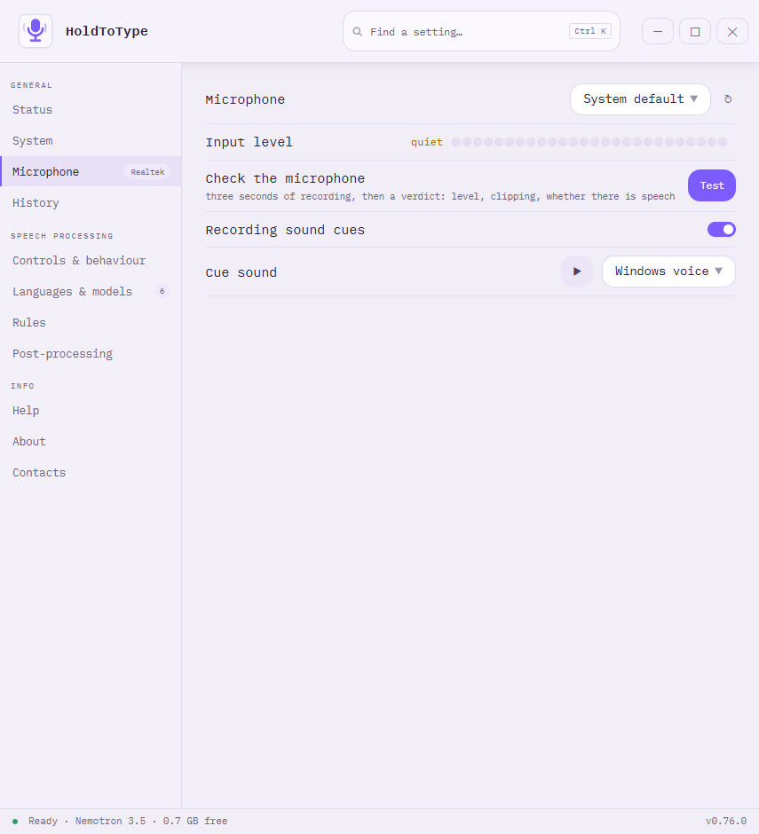](docs/shot-mic-soft.png) | [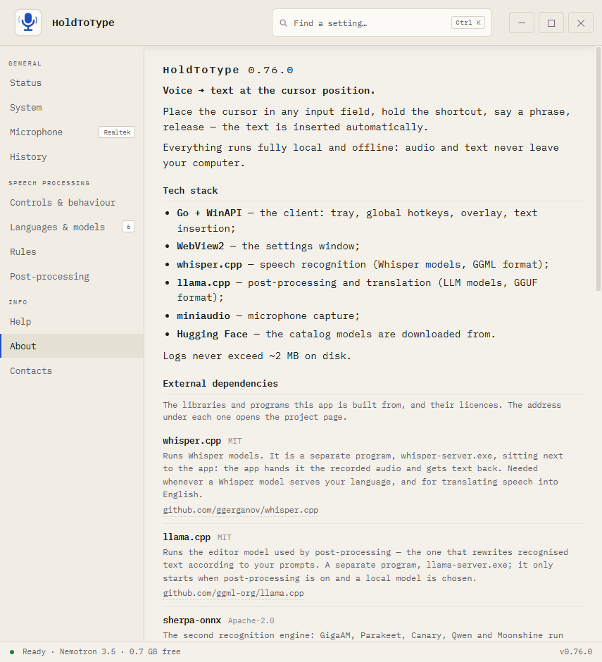](docs/shot-about-paper.png) |
| **Contacts — Neon** | **Installer** |
| [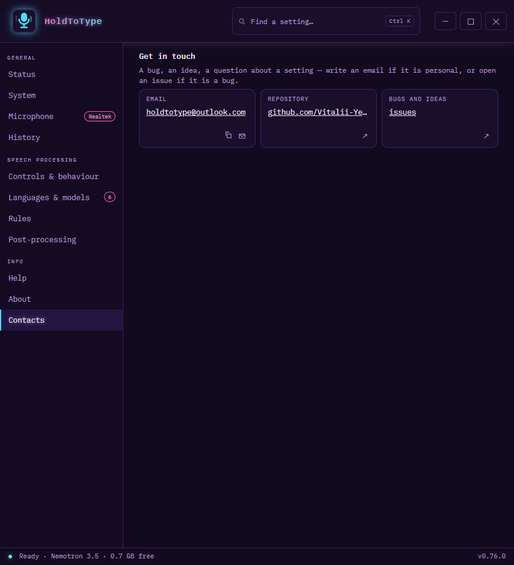](docs/shot-contacts-neon.png) | [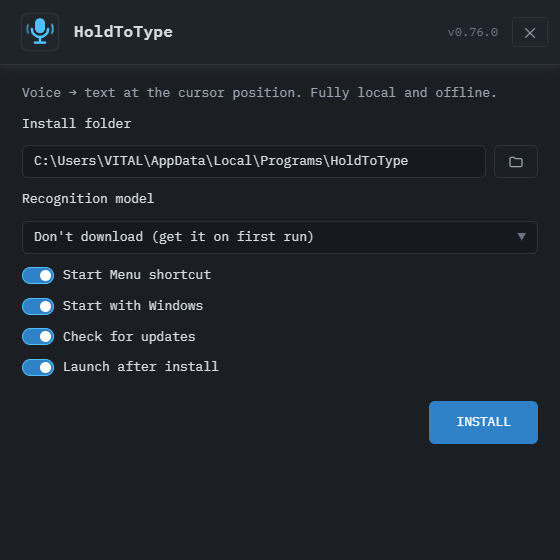](docs/setup.png) |

## ✨ Features

- 🎙️ **Dictation at the cursor** — a global configurable hotkey (left and right modifiers are interchangeable — Ctrl means either one); text is inserted via the clipboard or typed character-by-character (for paste-blocked fields), with optional auto-Enter.
- 🎯 **Safe insertion** — the target window is captured when you press the hotkey; if focus changes while the speech is processed, nothing is pasted — the plate itself asks on a second line: *Insert here* / *Copy*. The window is checked once more in the instant before the text goes in and again before auto-Enter: if it moved in the meantime, nothing is typed anywhere — the text lands on the clipboard and the plate says so. The final transcript always stays available in the tray (*Copy last result*), so a failed paste never loses a dictation.
- 🗂️ **Rules per application** — a rule per program (`chrome.exe`, `Telegram.exe`, commas for several, `teams*` for a family): insert with the clipboard or character by character, press Enter or never, wait a moment before inserting, and run its own prompt — or none at all. The first matching rule wins; without a rule nothing changes. One button turns the program you last dictated into a rule.
- 📋 **Clipboard-friendly** — restoring the clipboard after insertion preserves **all** formats (images, files, rich text); when a snapshot is impossible the clipboard is left untouched and the text is typed instead.
- 📟 **On-screen overlay** — one pill and nothing else: live voice level while recording — the bars stand on the pill's middle line, level with the ✕, and open upwards and downwards at once — processing stages (a warning along the way is shown on the same pill without ending the work or taking the ✕ away), a pause that looks like a pause and an error that carries its own shape, not just another colour, the recognised text itself when it lands, and — on a second line when needed — the questions (which language to translate into, where to insert when focus changed) with mouse or keyboard answers. It can sit at any of eight places — the corners and the edge middles, picked on a little screen map — or be dragged on that map to any spot you like, remembered per screen resolution; following the cursor stays the ninth choice. With more than one monitor you pick the screen that carries it, or leave it to follow the cursor. While a question is open the pill says it is waiting for you instead of claiming to be working, every answer carries its number, and the keys are spelled out on the same row. The last ten seconds before the recording limit are counted down on the pill in amber. The questions wrap onto a second row when the language names are long, so nothing falls outside the pill; the plate is placed on the monitor you are working on and takes that monitor's scale, even when the two screens are scaled differently. A long dictation is shown up to a readable width and then wraps, growing the pill downwards to six lines at most — past that the tail is cut with an ellipsis; the dot, the close mark and the level all stay on the first line. It stays on screen longer the more there is to read — up to five seconds. The ✕ or Esc cancels at any stage; input focus is never stolen.
- 🌍 **Translation powered by Whisper** — to English via the native translate mode, to any other interface language by forcing the output language. Three modes: always translate to the target language, ask on the plate before every dictation, or ask with a countdown.
- 🤖 **LLM post-processing** (llama.cpp) — a chain of prompts removes filler words, changes style, formats text; each prompt can have its own hotkey; a test field runs a sample through the live model right from Settings. By default it is a local model; those who want a stronger editor can point the chain at any OpenAI-compatible server — with the honest warning above.
- 🧩 **Every language picks its own model** — a preset row per language: out of the box Whisper Medium serves them all, and any row can be changed — Ukrainian to Moonshine, all of Europe to Parakeet, and a narrow single-language model wherever it beats a big one: GigaAM v3 through sherpa-onnx punctuates by itself and, on the same 11-second file, took 0.47 s against the 11.6 s of Whisper, 277 MB of RAM against 814 MB, and made no mistakes against three. Nothing is forced: the app proposes, you assign. The engine a dictation needs starts in about a second and a second engine unloads itself after ten idle minutes, so two models never sit in memory for nothing — and a button unloads them right now, giving the memory back until the next dictation. A model that cannot translate says so in its preset row, in the library and in the Translation block — and when you ask it to translate anyway, the overlay asks whether Whisper should step in.
- ⚡ **Live text while you speak** — assign Nemotron 3.5 (40 languages, punctuates and capitalizes by itself) to a language, and the words appear on the plate as you say them, refreshed a few times a second. While you are silent the plate is just its control row — recording dot, a running time counter, the voice level and the ✕. The first words open a text panel under a thin divider: one line, then two, then three, growing with what you say; past three lines the older text slides up out of view under the divider. And when you release the key, no farewell popup repeats what you have already read: the plate simply goes away. Release the key and the finished phrase goes through the same replacements, prompts and insertion as any other dictation. Pauses do not lose text: the phrase is stitched together across them. When the stream cannot start, the dictation falls back to ordinary recognition on the same model — nothing is lost.
- 🧭 **Model picker and honest numbers** — three questions (language, priority, translation) and the catalog answers with a model and the reason. Every entry shows the memory it will actually take, measured against what is free right now, and filters narrow the list by language, by models that punctuate on their own, or simply to "fits in memory".
- ✏️ **Punctuation your way** — take it from the recognition model, have the editor model add it, or strip it and get plain lowercase text.
- 🔐 **Files that are what they claim** — every model in the catalog carries a reference SHA-256; a freshly downloaded file that does not match is deleted instead of used, one button re-checks the models already installed, and the same check runs on the installer an update downloads.
- 🧳 **Lists to carry over** — replacements and voice commands save into a single .json file and load on another machine; loading adds only what is missing and reports how many lines were added and how many were already there.
- 📦 **Built-in model catalog** — recognition models download in one click, with a live percentage, a stop button and free-space checked before the download starts (a partly downloaded file counts, so resuming needs only what is left). When the download finishes the model is put to work by itself. GGUF models for the LLM are searched on Hugging Face with last-update date, download counts and a color indicator showing whether the model fits your RAM — those downloads can be stopped too, and they check free space the same way. The model in use can be deleted when the disk is full: the app warns that recognition stops until another one is picked.
- 🎚️ **Microphone control** — a microphone that stops sending sound (unplugged USB, a Bluetooth headset that wandered off) is noticed within a second and a half: the recording stops with a message instead of ending in silence, the level meter drops to zero instead of freezing, and the app returns to the system default device. Pick the input device from the settings, watch a live level meter before dictating — on the Status card it runs the whole width of the card and follows it as the window is resized, and it fills up to the current loudness on a decibel scale instead of drawing a waveform, so even a quiet microphone moves it — and press Test: three seconds are recorded and taken apart — peak level, how much of it holds speech, how much was clipped — and the answer comes in words, with what to do about it. The same numbers are measured after every dictation, so a failed recognition says whether it was too quiet, clipped or plain silence. Silent recordings are never sent to recognition, and a headset unplugged mid-session falls back to the system default.
- 🔤 **Replacements after recognition** — a list of what the model mishears and what it should become: `git hub` → GitHub, surnames, in-house terms. Each rule serves every language or is pinned to one, so a fix meant for one language never mangles a dictation in another. They run right after recognition and before the prompts, match whole words and ignore case by default, and a field right there tries them on any phrase without dictating.
- 🗣️ **Voice commands** — say "new line" and get a line break, "new paragraph" and get two, "cancel" and the dictation is thrown away without inserting anything; or have a phrase drop in any text you like. One button fills the list with the usual phrases in your language. They run after the replacements, so prompts and translation get the finished text.
- 🕘 **History of dictations** — off by default; turn it on and the last N dictations stay on this machine as text (never audio), searchable by text or by the program they went into, one click to copy, one to paste it back into the window you came from, one to wipe them all. The list of programs nothing is ever recorded from — password managers, banking apps — sits next to the switch and is never folded away. The retention you set is enforced when the history is opened and whenever you change it, not only when the next dictation arrives.
- 📖 **Recognition dictionary** — terms and abbreviations hint rare words to Whisper. A starter set of development and internet vocabulary comes preinstalled and follows the recognition language; write your own and it is never touched again. When a dictation is translated, the hint switches to the target language, so the output vocabulary matches the output. Only Whisper models read it — the page says so plainly, since GigaAM, Parakeet and the rest never see the hint.
- 🎨 **Design and colour, kept apart** — five designs, each dressed the way its namesake dresses. Terminal is the green default: monospace, brackets around the buttons, square corners, a halo on the text. Editor follows VS Code: the system face for the interface with monospace kept for paths and shortcuts, filled blue buttons, red for the destructive ones, the editor's own focus ring, round dots, pill badges. Neon is violet and rounded, and its buttons take the look of its own shortcut chip — a gradient fill under light text. Soft stands on dusty rose with filled buttons and green status dots, Document on a soft grey desk with grey buttons and blue kept for the main action. A design carries its own font, corner radius, border width, halo, scanlines, the way the level meter moves, the shape of its own mark — Soft is a face, the rest a microphone — and what the pill does the moment the text lands: Terminal blinks, Neon flares, Soft bounces, Editor and Document stay still. Terminal and Neon are set in IBM Plex — Mono and Sans — both carried inside the exe, so they read the same on any machine; Editor keeps Cascadia Mono, Soft is set in a rounded face and Document in the system one — the faces they were drawn with. A light design carries its light through everything the program draws: the title bar Windows itself paints, the plate, the tray menu, the tray icon and the installer. Colour is offered to Terminal alone — green, amber, blue, pink — and touches nothing but the colour of the window, the plate and the tray icon; the other two designs bring their own. Either choice repaints the whole program at once, with no restart. The installer follows the design of the copy it is updating.
- 🗣️ **8 UI languages** — English, Ukrainian, Russian, German, French, Spanish, Italian, Polish. Everything is translated: screens, dialogs, the overlay, the tray, the uninstaller and the in-app guide. Switching is instant, "Same as system" follows Windows.
- 🔊 **Sound themes** — several synthesized cue sets plus Windows system sounds, with preview.
- ⚡ **Nothing to save, nothing to restart** — every change applies the moment you make it; the Save button is gone. The settings that describe the recognition server — port, threads, server path, remote URL, autostart — restart the recognizer itself, which takes about a second; the app is never asked to be restarted. A setting is written to disk before it is applied: if the file cannot be written, the old values stay in force and the window says so instead of pretending. A value the program refuses — a port outside 1024–65535, an empty list of languages for the translation question — is reported, not silently dropped.
- 🔍 **Find a setting** — Ctrl+K, a word, and the window jumps to the right section and highlights what matched: a setting row, a section heading or a hint. It works on any keyboard layout, and Escape clears the search and gives the focus back to where you were.
- 🧭 **First-run wizard** — five steps on the very first launch: interface language, the dictation language (the model is chosen and downloaded for you, with a progress bar), the shortcut and microphone with a live level bar, a field to try a real dictation into, and starting with Windows. The step with the model does not let you walk past a running download, and it applies the whole plan — the model for every language on it, not just the first line. Skipping is allowed at any point, but without a model there is nothing to recognise with: the Status screen says so and the catalog is one click away. Upgrades never see the wizard.
- 🎚️ **Simple mode** — new installs fold away what is rarely touched, grouped by how risky and how frequent it is rather than by count: punctuation and the dictionary stay in sight, while replacements, voice commands and the prompt chain wait behind "N more settings". The programs history must never record from are never folded away. A SIMPLE/ALL switch in the title bar shows which view is on, and upgrades keep the full view.
- ⏯️ **Hold or toggle, with a pause** — hold the keys as before, or press once to start and once to stop; in toggle mode a second shortcut pauses and resumes the recording (the pill shows a pause sign and the meter stops), and the length limit does not run out while it is paused.
- 🖥️ **One window, eleven sections** — a sidebar instead of tabs inside tabs, gathered in three groups: General (Status, System, Microphone, History), Speech processing (Controls & behaviour, Languages & models, Rules, Post-processing) and Info (Help, About, Contacts). The Status screen answers "is everything ready" at a glance — hotkey, microphone, engine and model, free memory, last dictation — and a status bar keeps that answer visible from every section.
- 🖥️ **Tray application** — a status icon whose failure state carries a badge instead of yet another shade of grey, a quick menu that sizes itself to the language it is written in, walks with the arrow keys and closes on Escape, and comes back after Explorer restarts, a Pip-Boy-terminal-styled settings window that remembers its size.
- 💾 **Portable** — the folder is self-contained: copy it to a USB stick and run on another PC; nothing is written to the registry.
- 🛡️ **Private** — zero network requests while dictating; internet is only needed to download models. The one exception you create yourself: an external post-processing server, configured by hand in Settings, receives the recognized text (never the audio) — the page says so in plain words, asks before the address is applied, and keeps the API key encrypted with Windows DPAPI.

## 🚀 Installation

### Option A — installer

Download `holdtotype-setup.exe` from [Releases](https://github.com/Vitalii-Yemets/holdtotype/releases) and run it. The themed installer (~16 MB):

- installs without admin rights to `%LOCALAPPDATA%\Programs\HoldToType` (pick any folder via the browse button);
- can download the recognition model right during installation (GigaAM v3, or Whisper Base / Small / Medium / Turbo) — by default it downloads nothing and the app fetches what its wizard proposes (Whisper Medium; the download can be put off and picked up later from Languages & models); a download in progress can be stopped, and the installation still finishes;
- can turn the update check on or off, and the answer is written into the app's settings;
- creates a Start Menu shortcut and, optionally, autostart with Windows;
- registers in "Apps & features".

Silent install: `holdtotype-setup.exe -silent -dir "C:\path" -model small` (model: `gigaam-v3|base|small|medium|turbo`, omit to skip; add `-no-updates` to turn the update check off).

### Updates

- **About** has a "Check for updates" button; optionally the app can check on startup (off by default — this is the only network request besides model downloads).
- One click downloads the new installer and updates in place: **settings and downloaded models are always preserved** — the whole cycle is exercised on a real install before every claim here, down to comparing the model files byte for byte. The app restarts itself. Automatic checking stays off by default: an offline tool does not phone home unless you ask it to. GitHub publishes a SHA-256 for every release file, and the downloaded installer is compared against it — a file that does not match is deleted instead of started.
- Running a newer `holdtotype-setup.exe` manually also detects the existing installation and switches to update mode.

### Option B — portable

Download the archive from Releases (or build `dist/` yourself), copy the folder anywhere and run `holdtotype.exe`. Settings, models and the log live next to the exe and travel with the folder.

### Requirements

- Windows 10/11 x64;
- a CPU with AVX2 (roughly 2013 or newer) — **no GPU required**;
- WebView2 Runtime for the settings window (bundled with Windows 11; if missing, the app opens the download page);
- RAM: ~1 GB for recognition (small model); for LLM post-processing — depends on the chosen model (the search indicator will tell).

## 🎯 Usage

1. Launch the app — a green microphone icon appears in the tray.
2. On the very first launch a five-step wizard opens: interface language, the language you will dictate in (it picks and downloads the model for you), the shortcut and microphone with a live level bar, a field to try a dictation into, and — last — starting with Windows. Skip it at any point — the app keeps running, but until a model is downloaded it cannot recognise anything, and the Status screen says exactly that. Run `holdtotype.exe -wizard` to see the wizard again.
3. Place the cursor in any input field, **hold `Ctrl+Win`** (configurable), say a phrase, **release** — the text is inserted.
4. Right-click the tray icon — the menu: enable/disable, settings, copy the last result, config, log, about, quit.

Icon colors: green — ready, red — recording, orange — transcribing, grey — disabled/error.

A full description of every feature lives in **Help** — sixteen sections written for people rather than for the interface, with mock-ups of the plate, the cards and the fields drawn inline. The contents stand in a column on the right that follows you as you read and highlights the section you are in; on a narrow window an icon in the corner widens the window to bring them back. The search in the header (Ctrl+K) reaches into the manual too — a word from it is found just like a setting.

### Safe insertion

<p align="center">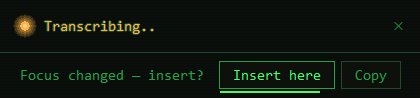</p>

Speech processing takes a few seconds — if you switch windows in the meantime, HoldToType notices that the focus no longer matches the window you dictated into. Nothing is pasted blindly: the plate grows a second line and asks: insert into the current window, copy the text to the clipboard, or keep it. The countdown runs under the safe answer — say nothing and after 30 seconds the text simply stays with you, in Last Result and on the clipboard, rather than being typed somewhere you were not looking. Enter takes the highlighted answer, 1…9 pick a button, Esc cancels. The result is also kept in memory — the tray menu's *Copy last result* recovers any dictation whose insertion failed.

## ⚙️ Settings

Left-click the tray icon to open the settings window. Eleven sections in three groups — General, Speech processing, Info — every setting always visible, no "simple" and "advanced" modes, and no tabs inside tabs:

| Section | Contents |
|---|---|
| **Status** | is everything ready, at a glance: hotkey, microphone with a level meter the width of its card, the model behind the current language, the post-processing model, free memory — with the models actually sitting in it named right beside, so the number means something — and the last dictation with *Copy* and an honest word about how it sounded: level fine, too quiet, clipped. Below: every model in use with the languages it serves, the models installed locally, and the week as a pie: one slice per program, the count inside the slice when it fits, the programs listed as chips beside it — drawn from the history that never leaves the machine, and absent altogether when the history is switched off. When the recognizer will not start, this screen says why and offers *Try again* — no app restart |
| **History** | the switch that turns it on; how long an entry lives — any number of minutes, hours or days, typed by hand — and how many entries to keep at most; the programs nothing is ever recorded from, added from the list of open windows and worn as removable chips; search, and per entry: copy, paste back into the window you came from, delete, and clearing everything. Three blocks parted by a line, and every entry says the day it goes |
| **Controls & behaviour** | the hotkey, hold or toggle, the recognition model with its language right beside the shortcut they serve, auto-Enter, the pause shortcut, recording durations, clipboard restore, character-by-character typing, the on-screen overlay with its little screen map — eight positions, a draggable miniature, cursor-follow, and a monitor choice when there is more than one — and the whole of translation: target language, when to ask, dialog languages, its own shortcut |
| **Microphone** | input device with a live level meter, recording cue sounds and the sound theme |
| **Languages & models** | a list of languages, each row naming its model; a language without one of its own says, in dimmed text, that it follows Auto-detect. Click a language and the models that can serve it unfold right under it — the assigned and the recommended first, each card with its accuracy and speed bars, its languages and translate ability in words, an honest RAM number; the missing ones carry a size and a download arrow, and the licence-bound one explains itself instead of offering a download. A click on a card is the choice — a missing model downloads itself and takes over once ready, and the one download shows its progress in every language that lists the model, on the collapsed row, and in a line above the list. Below, the upkeep block: your own model (a Whisper ggml `*.bin` file or a sherpa-onnx folder dropped into `models/`, found after a restart and shown honestly without bars, since its powers are unknown), unloading from memory, the button that re-checks installed files against their reference hashes, and the plain line that everything runs on the CPU |
| **Rules** | where punctuation comes from, the recognition dictionary (read by Whisper models only — the page says so), replacements — each one pinned to a language or serving them all — voice commands with save-to-file and load-from-file, and the per-application insertion rules |
| **Post-processing** | the editor model (installed + Hugging Face search, filtered by default to files that fit this computer, with the hidden ones counted), the chain of editing prompts with their shortcuts, and the external OpenAI-compatible server for those who want one |
| **System** | three groups without headings — how the app looks (interface language, design, colour), how it starts and keeps itself current (start with Windows, check for updates, check now), and the maintenance buttons (open the log, re-read config.json, reset the settings), all of one width. Below, the recognition server as two cards with a switch: on this computer — threads, autostart, port and the path to whisper-server, edited in a window of its own — or on another one, with its address. Choosing the remote one without an address is an honest failure: the Status card goes red, the badge beside System turns red, and the status bar says recognition is unavailable |
| **Help** | the manual: sixteen sections written for people rather than for the interface — what happens after you release the keys, what each tab does, what every option changes and what it costs, what lives in the app folder, what leaves for the internet, and what to do when something misbehaves, with mock-ups of the plate, the cards and the fields drawn inline. The contents sit in a column on the right that follows you as you read; on a narrow window an icon in the corner widens the window to bring them back |
| **About** | the version, what the app is made of, and every external dependency — engine, library, font, catalogue — with its licence, its address and a plain line about what it does here and when it runs |
| **Contacts** | three cards: the mail address, which opens your mail program and copies with one icon, the repository, and the page for bugs and ideas |

The title bar carries three buttons — hide to the tray, fill the screen, close — and the filled window comes back to the size it had; a size set with the mouse is remembered and filling the screen never replaces it. The window never gets smaller than 760×500, so the rows and cards keep the shape they were drawn for, and never larger than 1120×940, where the widest row has all the room it needs — filling the screen stops at that size and centres. A fresh install opens at 860×620. Every edge and corner resizes, the top one included. Everything applies the moment you change it — there is no Save button and no dialog about unsaved changes. A shortcut is one control, not a chip beside a button: the keys are the label of the button you press to change them, and the small window that asks for the new combination sizes itself to what it says and sets the words in the middle of it. Questions the app asks are proper dialogs: the window behind is out of reach while one is open, Tab stays inside it, Escape means no, and the focus starts on the safe answer. Settings that describe the recognition server (port, threads, server path, remote URL, autostart) restart the recognizer in place, so nothing waits for an app restart. Long names on the Status cards are cut with an ellipsis so the cards keep one line and their buttons stand level; the whole name waits under the pointer, in a hint drawn in the current skin's colours rather than the system's. Errors are written in words — "no connection to huggingface.co", "the disk is full" — with the library's own text kept for the log; a shortcut Windows has already taken is called out the moment you pick it. Settings that do not apply in the current mode are greyed out automatically, and so are buttons with nothing to act on — *Copy* with no last dictation, *Clear* with an empty history. Models are called the same everywhere — "Small", "GigaAM v3" — on the Status screen, in the preset rows, in the status bar and in the question before a deletion.

## 🌐 How translation works

All translation is done by Whisper itself — no second neural network needed:

| Target | Mechanism | Quality |
|---|---|---|
| English | native `translate` mode | excellent |
| other languages | forced output language (**experimental**) — the app tells the model to write in that language instead of asking it to translate | not guaranteed: the text may come back in the language you spoke |

Note: a model that cannot translate — Turbo, GigaAM, Parakeet, Moonshine — says so right in its preset row and in the Translation block; when you ask it to translate anyway, the overlay offers to hand the phrase to the most accurate Whisper you have installed, and inserts the text as recognized if you decline.

Canary 180M is the exception that translates without Whisper: between English, German, Spanish and French it does the job itself, in one pass, punctuation included.

Modes: "always translate to the target language" (a checkbox, no questions), "always ask" and "ask with a timeout" — a language dialog appears above the overlay before transcription; when the countdown expires the target language is applied, ✕/Esc inserts without translation.

## 🧠 Post-processing (LLM)

An optional second layer: a local language model edits the transcribed text according to your prompts. Presets ship out of the box: "Cleanup" and "Business style". Checked prompts apply as a chain to every dictation; a prompt with its own hotkey applies alone, once.

Models are picked via the Hugging Face search (GGUF format): every quant file shows its size and an estimated RAM requirement — a green/amber/red indicator relative to your RAM. Recommendations: 1.5–3B (Q4_K_M) — fast; 7–9B — smarter but takes seconds per pass on CPU.

## 🔨 Building from source

The only requirement is a running **Docker Desktop** — nothing is installed on the machine: no Go, no compilers, no packaging tools.

```powershell
.\build.ps1                 # small model (~466 MB)
.\build.ps1 -Model medium   # more accurate, larger
```

The result lands in `dist/`:

| File | What it is |
|---|---|
| `holdtotype.exe` | tray client (Go + WinAPI, WebView2) |
| `whisper-server.exe` | recognition (whisper.cpp), static build |
| `sherpa-server.exe` | recognition (sherpa-onnx), official static build, pinned and checksum-verified |
| `sherpa-online-server.exe` | streaming recognition (sherpa-onnx), from the same pinned archive |
| `llama-server.exe` | post-processing (llama.cpp), static build |
| `holdtotype-setup.exe` | installer (Go + WebView2, payload embedded) |
| `models/ggml-*.bin` | the Whisper model |
| `models/gigaam-v3/` | the GigaAM v3 model: encoder, decoder, joiner, tokens |
| `models/nemotron-3.5/` | the Nemotron streaming model, when downloaded |
| `config.default.json` | default settings |

The pipeline: MinGW-w64 cross-compilation of whisper.cpp and llama.cpp inside a Linux container, the Go client with cgo (microphone capture), icon generation, installer packaging — all in `build/Dockerfile`. Both engines are pinned to specific upstream versions (`WHISPER_CPP_VERSION`, `LLAMA_CPP_VERSION` build args), so builds stay reproducible.

## 🧪 Tests

Everything runs in containers — nothing to install locally:

```powershell
docker build --file build/Dockerfile --target gotest .        # Go unit tests + go vet (Windows target)
docker run --rm -v "${PWD}:/w" -w /w node:20 sh -c "node test/build-page.js && cd test && npm i --no-save --silent jsdom && node ui.test.js"
```

- `client/internal/...` — unit tests for the pieces that carry logic: version comparison, hotkey duplicates, per-application rules, replacements, voice commands, history, prompt chains, sound analysis, file hashes and the lists file.
- `test/ui.test.js` — the real settings page rendered in jsdom: section switching, the translation enable/disable matrix, the prompt editor accordion, rules, replacements, commands and their file, history with copy and paste-back, model deletion and the model check, the first-run wizard, and "no JavaScript errors".
- `test/locales.test.js` — every one of the eight languages carries every string the page and the program ask for, and invents none of its own.
- `test/setup.test.js` — the installer page: the steps, the model choice, the silent switches.
- `client/internal/theme` — every design keeps its own face, corners, level marks and lamps, and the CSS variables the page needs are all there.

The same suites run in GitHub Actions on every push, together with a full Windows build of all binaries.

## 🏗️ Architecture

```
┌────────────────────────────────────────────────────────┐
│  holdtotype.exe (Go + WinAPI)                         │
│  tray · keyboard hook · recording · overlay · paste    │
│  settings UI: WebView2                                 │
└──────────┬─────────────────────────────┬───────────────┘
           │ HTTP 127.0.0.1:8910         │ HTTP 127.0.0.1:8911
   ┌───────▼────────┐            ┌───────▼────────┐
   │ whisper-server │            │  llama-server  │
   │  recognition   │            │ prompts (LLM)  │
   │ + translation  │            │   on demand    │
   └────────────────┘            └────────────────┘
```

The servers are hidden child processes tied to a Job Object: they die together with the app. A server that fails to start — a busy port, a wrong path — no longer ends the story: the app keeps running, the Status screen names the reason, and fixing the setting (or pressing *Try again*) brings the recognizer up in place. They listen on localhost only, and llama-server is additionally protected with a per-session API key, so other local programs cannot use it. The Whisper model stays in memory between phrases; the LLM starts on first use.

**Data boundary:** everything is processed locally. The only exception is the second card under *Recognition server* in the System section — *On another computer* — which sends the recorded audio to the address you give it instead of to the local engine. The app asks before it applies such an address and applies nothing until you answer yes; an address typed but not confirmed is never saved, not even by changing some other setting. Use it only with hosts you trust; leave it empty for a fully offline setup.

The log is written in English whatever language the interface is set to: an error carries two texts, the English one for the file and the translated one for the window, so a log can be read by anyone who has to fix the program.

Files next to the exe: `config.json` (all settings; manual edits apply via "Reload config.json" in the tray menu) — a key the app does not know is skipped with a line in the log instead of resetting everything; when an update migrates the config to a new shape, the untouched old file is kept once as `config.json.vN.bak`, so any migration can be undone by hand, `holdtotype.log` (rotated, never exceeds ~2 MB on disk), `models/`.

## 🗑️ Uninstall

"Apps & features" → HoldToType, or `holdtotype.exe -uninstall`. The uninstaller asks whether to delete settings and downloaded models, then cleans up files, the shortcut and the registry. The portable version is removed by deleting the folder.

## 📄 License

[MIT](LICENSE) © Vitalii Yemets.

Everything shipped in the archive, and every model the app offers to download, is under a permissive license — none of them restricts commercial use, donations or a paid build:

| Part | What it is | License |
|---|---|---|
| [whisper.cpp](https://github.com/ggml-org/whisper.cpp) | `whisper-server.exe` — recognition on Whisper models | MIT |
| [llama.cpp](https://github.com/ggml-org/llama.cpp) | `llama-server.exe` — post-processing | MIT |
| [sherpa-onnx](https://github.com/k2-fsa/sherpa-onnx) | `sherpa-server.exe` and `sherpa-online-server.exe` — recognition beyond Whisper, batch and streaming | Apache 2.0 |
| [malgo](https://github.com/gen2brain/malgo) / miniaudio | microphone capture | Unlicense (public domain) |
| [gorilla/websocket](https://github.com/gorilla/websocket) | the link to the sherpa engines | BSD-2-Clause |
| [go-webview2](https://github.com/jchv/go-webview2) | the settings window | MIT |
| [golang.org/x/sys](https://pkg.go.dev/golang.org/x/sys) | Windows API bindings | BSD-3-Clause |
| [go-winloader](https://github.com/jchv/go-winloader) | loading the WebView2 libraries, used by go-webview2 | MIT |
| [ggml](https://github.com/ggml-org/ggml) | the maths inside whisper.cpp and llama.cpp | MIT |
| [ONNX Runtime](https://github.com/microsoft/onnxruntime) | runs the models inside sherpa-onnx | MIT |
| [IBM Plex](https://github.com/IBM/plex) | Sans for the Neon design and Mono for Terminal, both carried inside the exe | SIL Open Font License 1.1 |
| Whisper models — Tiny, Base, Small, Medium, Turbo | [ggerganov/whisper.cpp](https://huggingface.co/ggerganov/whisper.cpp) on Hugging Face | MIT |
| [GigaAM v3](https://github.com/salute-developers/GigaAM) | a single-language model, converted for sherpa-onnx | MIT |
| [Parakeet TDT 0.6B v3](https://huggingface.co/nvidia/parakeet-tdt-0.6b-v3) | 25 European languages in one narrow model, converted for sherpa-onnx | CC-BY-4.0 |
| [GigaAM v2](https://github.com/salute-developers/GigaAM) | the previous generation of the same model, converted for sherpa-onnx | MIT |
| [Nemotron 3.5 ASR Streaming](https://huggingface.co/Masterx/sherpa-onnx-nemotron-3.5-asr-streaming-0.6b-560ms-2026-06-11) | 40 languages with live partial text, converted for sherpa-onnx | OpenMDW-1.1 |
| [Canary 180M Flash](https://huggingface.co/nvidia/canary-180m-flash) | English, German, Spanish, French — translates between them by itself, converted for sherpa-onnx | CC-BY-4.0 |
| [Qwen3-ASR 0.6B](https://huggingface.co/Qwen/Qwen3-ASR-0.6B) | about 30 languages with punctuation, converted for sherpa-onnx | Apache 2.0 |
| [Moonshine Base uk](https://github.com/moonshine-ai/moonshine) | the Ukrainian model, converted for sherpa-onnx; its licence forbids redistribution, so the app links to the archive instead of downloading it | Moonshine Community License (non-commercial) |
| Qwen2.5-1.5B-Instruct | the editing model the app suggests first | Apache 2.0 |

The WebView2 Runtime is Microsoft's and is not shipped with the app — Windows 11 has it, and Windows 10 gets it from Microsoft's own installer.

One thing is on you: the **editing models you find yourself** through the Hugging Face search inside the app. Those carry whatever license their author chose, and some of them do limit commercial use — the license is written on the model's page, next to the files.

## 👤 Author

**Vitalii Yemets** — [github.com/Vitalii-Yemets](https://github.com/Vitalii-Yemets)

Found a bug or have an idea — open an [issue](https://github.com/Vitalii-Yemets/holdtotype/issues).
